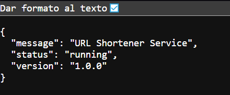
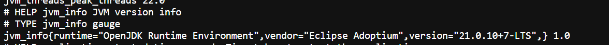
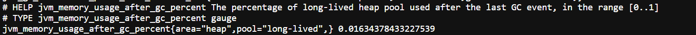
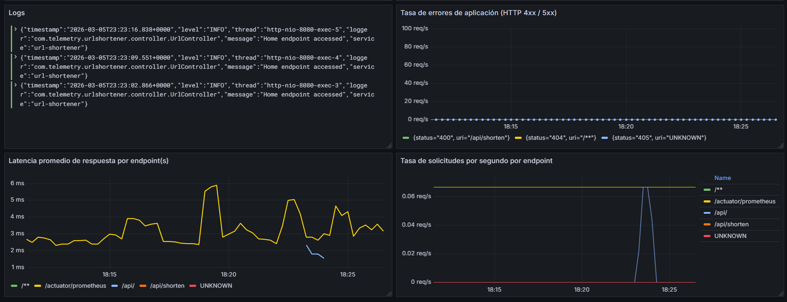
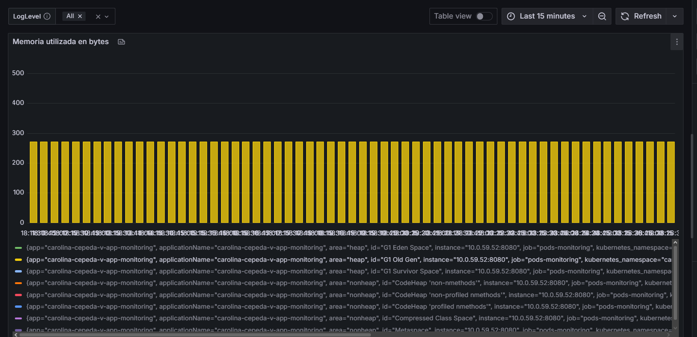
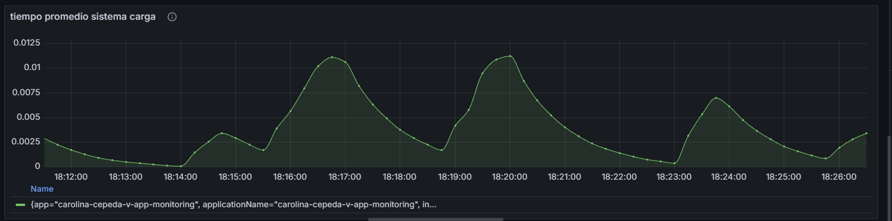

# Bitácora Experimento - Observabilidad y Monitoreo

**Nombre del estudiante:** Carolina Cepeda Valencia
---
Cuando acabes no olvides ayudarnos evaluando tu ⭐[experiencia](https://forms.office.com/r/JCyhCpujrt)⭐
---

## Tabla de Contenidos
- [Etapa 1: Preparación del Ambiente](#etapa-1-preparación-del-ambiente)
- [Etapa 2: Métricas Iniciales](#etapa-2-métricas-iniciales)
- [Etapa 2.1: Dashboard Base en Grafana](#etapa-21-dashboard-base-en-grafana)
- [Etapa 2.2: Propuesta de Métrica Personalizada](#etapa-22-propuesta-de-métrica-personalizada)
- [Etapa 3: Experimentación y Análisis del Sistema](#etapa-3-experimentación-y-análisis-del-sistema)

---

## Etapa 1: Preparación del Ambiente

### 1.1. Información de la aplicación

### 1.2. Verificación del despliegue

**¿La aplicación se desplegó correctamente?** 

- [X ] Sí
- [ ] No

**Captura de pantalla de la aplicación funcionando:**


dominio: https://carolina-cepeda-v-app.obs-stack.eci-idp.click/api/


### 1.3. Observaciones y problemas encontrados (opcional)

```


```

---

## Etapa 2: Métricas Iniciales

### 2.0.1. Generación de tráfico

**Endpoints probados:**

- [ ] `GET /api/`
- [ ] `POST /api/shorten`
- [ ] `GET /api/{shortCode}`
- [ ] `GET /api/urls`


### 2.0.2. Análisis de dos métricas relevantes

dominio para métricas: https://carolina-cepeda-v-app.obs-stack.eci-idp.click/actuator/prometheus

#### Métrica 1

**Nombre de la métrica:**  
```
jvm_info JVM version info
```

**Tipo de métrica:** 
- [ ] Counter
- [X] Gauge 
- [ ] Histogram 
- [ ] Summary

**Descripción de qué información aporta:**
```
aporta información respecto a la versión de la máquina virtual de Java ( JVM)


```

**Relación con otras métricas (si aplica):**
```

```

**¿En que escenarios puede ayudar esta métrica?**
```
Esta métrica permite saber que versión de JVM se está usando , permitiendo evitar problemas de 
compatibilidad con otras aplicaciones o herramientas


```

**¿Qué etiquetas (labels) se utilizan para agrupar los datos?**
```
Se usa runtime, vendor y version


```

---

#### Métrica 2

**Nombre de la métrica:**  
```

```

**Tipo de métrica:** 
- [ ] Counter
- [X] Gauge 
- [ ] Histogram 
- [ ] Summary

**Descripción de qué información aporta:**
```
Explica el uso de la memoria en base al último evento del Garbage Collector 


```

**Relación con otras métricas (si aplica):**
```
Un aumento en el uso de memoria desde el último evento, puede estar altamente relacionado con, por ejemplo, la lentitud a la hora de resolver solicitudes.


```

**¿En que escenarios puede ayudar esta métrica?**
```
Esta métrica ayuda a observar si es necesaria la optimización en términos de memoria, si es necesario usar otros administradores. 


```

**¿Qué etiquetas (labels) se utilizan para agrupar los datos?**
```
Se usan las labels area y pool

```

---


## Etapa 2.1: Dashboard Base en Grafana


### 2.1.1. Evidencia: Dashboard Base en Grafana con los 4 paneles iniciales

**Captura de pantalla del dashboard:**


### 2.1.2. Visualizaciónes Adicionales (Con las metricas actuales)

#### Visualización Adicional 1

**Propósito:**
```
¿Qué quieres analizar o mostrar? Menciona qué métrica(s) vas a usar

Quiero analizar como se comporta la memoria con el pasar del tiempo enla ultima hora en la aplicación,voy a usar la métrica de memoria utilizada en bytes.

```

**Título del panel:** 
```
Memoria utilizada en bytes
```

**Consulta (PromQL o LogQL):**
```
rate(jvm_memory_used_bytes{applicationName="carolina-cepeda-v-app-monitoring"}[1h])

```

**Tipo de visualización:** 
- [ ] Time series
- [ ] Gauge
- [X] Bar chart
- [ ] Stat
- [ ] Logs
- [ ] Otro: _____

**Otros ajustes aplicados (colores, unidades, etc.) (opcional):**
```


```

**Captura de pantalla:**


**Análisis (2-3 frases):**
```
Se observa que hay un diferente uso de la memoria dependiendo del área. Por ejemplo, el Heap G1 space es el que más usa memoria, en comparación a otros como G1 Old Gen que solo utiliza, en promedio, 271 bytes.


```

---

#### Visualización Adicional 2

**Propósito:**
```
Quiero analizar el tiempo de carga de la aplicación, para observar si sus componentes están
presentando problemas o insatisfacciones en los clientes.


```

**Título del panel:**
```
Tiempo promedio sistema carga
```

**Consulta (PromQL o LogQL):**
```
rate(system_load_average_1m{applicationName="carolina-cepeda-v-app-monitoring"}[$__rate_interval])
```

**Tipo de visualización:** 
- [X] Time series
- [ ] Gauge
- [ ] Bar chart
- [ ] Stat
- [ ] Logs
- [ ] Otro: _____

**Otros ajustes aplicados (colores, unidades, etc.) (opcional):**
```


```

**Captura de pantalla:**



**Análisis (2-3 frases):**
```
Se observan picos a la hora de ver el promedio de tiempo de carga de la aplicación, a pesar de que no son de gran tamaño generan curiosidad para saber cuáles son los recursos que están tomando ese tiempo.


```

---

### 2.1.3. Análisis final del dashboard

**¿Qué otros datos te gustaría visualizar si tuvieras más información disponible?**
```
Me gustaría ver cuanta memoria toma cada tipo de solicitud en promedio


```

---

## Etapa 2.2: Propuesta de Métrica Personalizada


### Análisis y propuesta de la métrica propia (en Java)

**1. Nombre de la métrica:**
```
Ejemplo: url_shortener_urls_created_total

```

**2. Tipo de métrica:**
- [ ] Counter
- [ ] Gauge

**3. ¿Qué comportamiento mide?**
```


```

**4. ¿Por qué es relevante para el sistema?**
```


```


---

### Visualización en Grafana

**1. ¿Qué tipo de panel usaste en Grafana?**

- [ ] Time series  
- [ ] Gauge  
- [ ] Stat  
- [ ] Bar chart  
- [ ] Otro: _____

**2. ¿Qué consulta PromQL vas a utilizar?**
```promql


```

**3. ¿Cuál es el propósito de la visualización?**
```
Provee una interpretación en palabras con el propósito de la visualización. Que te interesa ver en el panel?


```

---

### Panel creado en Grafana

**Captura de pantalla del panel en Grafana:**

> _[Inserta aquí la imagen del panel mostrando la métrica visualizada]_

---

## Etapa 3: Experimentación y Análisis del Sistema

### 3.1. Detección de anomalías y puntos de interés

**1. Como describirias la anomalía?**

```


```

**2. Que paneles te ayudaron a identificarlo?**

``` 


```

**3. Cual podria ser la causa de la anomalía?**

``` 


```

**Captura de pantalla del dashboard mostrando la anomalía:**

> _[Inserta aquí la imagen]_

---

### 3.2. Intento de corrección de anomalías


#### 3.2.1. Modificación del código

**Descripción del ajuste realizado:**
```
Describe en pocas palabras el ajuste realizado.


```

#### 3.2.2. Resultados después del despliegue

**¿El ajuste surtió efecto?**
- [ ] Sí 
- [ ] No 
- [ ] Parcialmente


**Captura de pantalla del dashboard después del ajuste:**

> _[Inserta aquí la imagen del estado del dashboard posterior al ajuste]_

---

### 5.7. Reflexión final

**¿Qué panel te resultó más útil para detectar problemas?**
```


```

**¿Qué métrica aporta mayor valor para monitorear un sistema real?**
```


```

**¿Qué agregarías o mejorarías en tu dashboard?**
```


```

**Fin de la bitácora**
